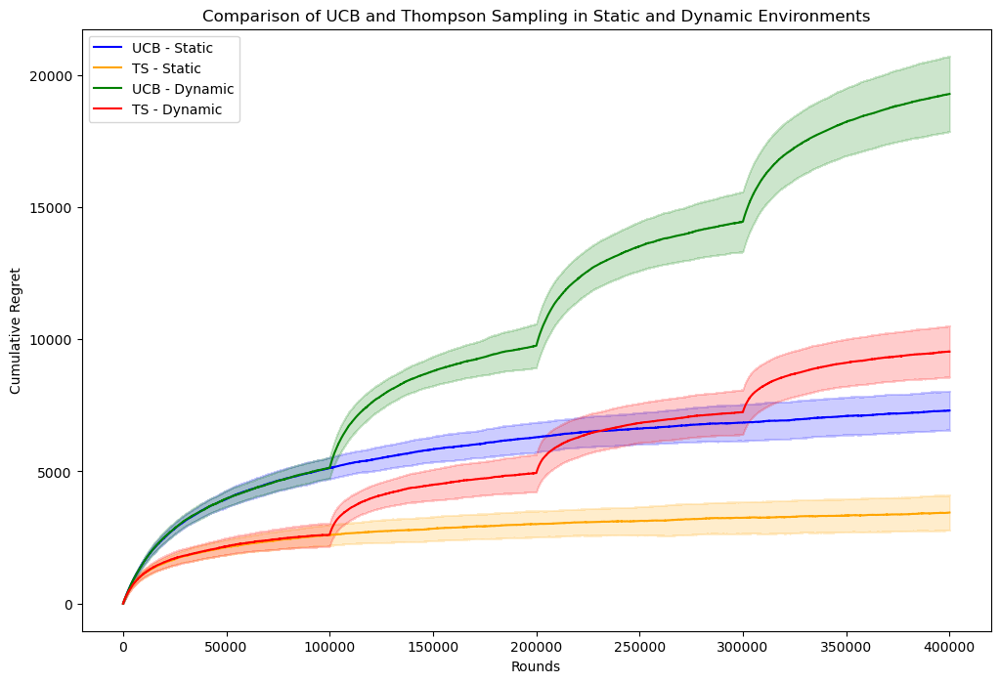
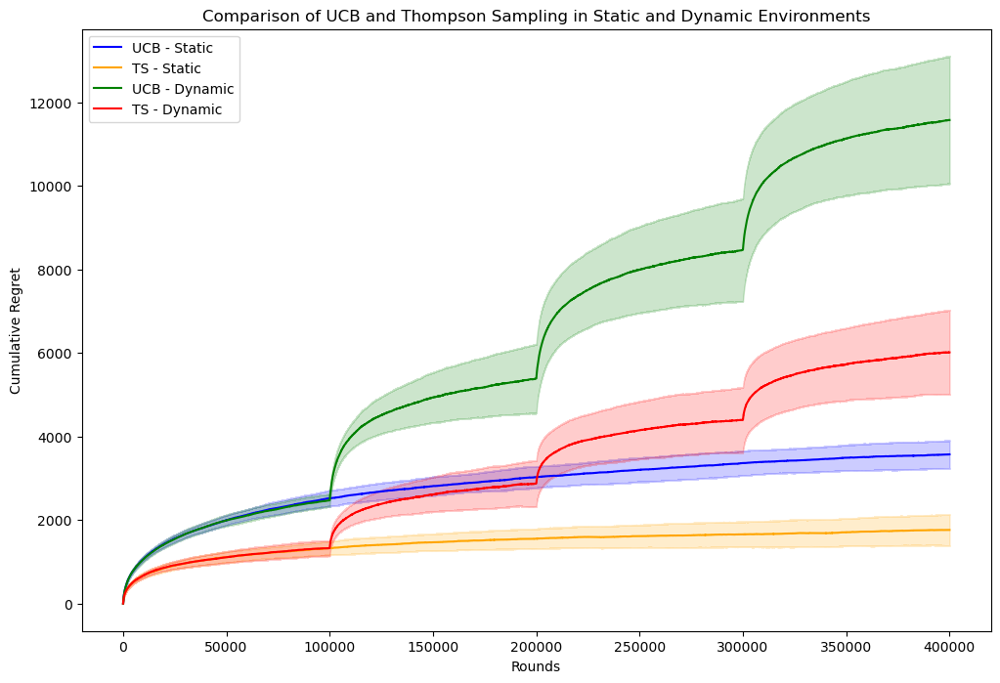
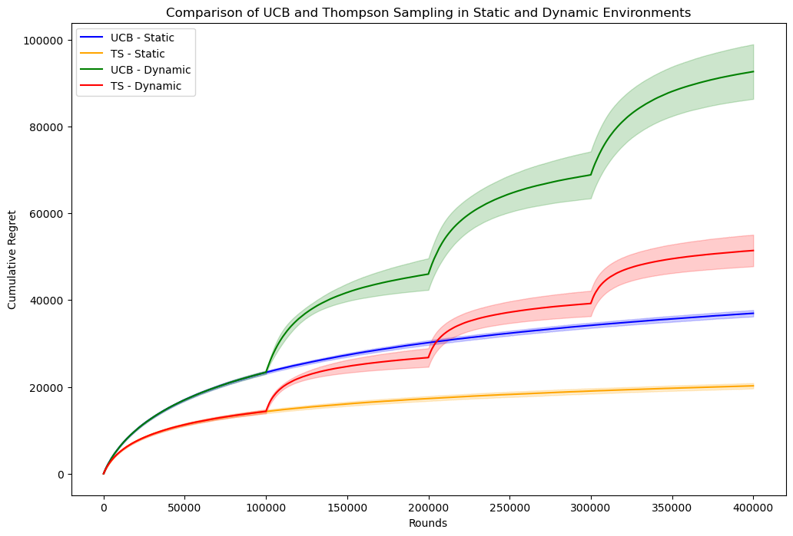

# Multi-Armed Bandit Analysis

This project compares Upper Confidence Bound (UCB) and Thompson Sampling (TS) in static and dynamic recommendation environments using the MovieLens 1M dataset.

## Project Overview

Movie genres and movie IDs are treated as arms in multi-armed bandit experiments. The performance of UCB and Thompson Sampling is evaluated using cumulative regret over 400,000 rounds.

Three experimental settings are included:

- 7 movie genres as arms
- 7 movie IDs as arms
- 70 movie IDs as arms

In the dynamic environment, reward distributions change after every 100,000 rounds.

## Algorithms

- Upper Confidence Bound (UCB)
- Thompson Sampling (TS)

## Dataset

The experiments use the MovieLens 1M dataset. The original dataset is not included in this repository.

After preprocessing, the dataset contains:

- 18 genre arms
- 3,706 movie arms

## Files

- `data_processing.py`: Loads and preprocesses the MovieLens dataset
- `genre_experiment.py`: Runs the movie genre experiment
- `movie_experiment.py`: Runs the movie ID experiments
- `regret_7_movie_genres.png`: Results using 7 movie genres
- `regret_7_movie_ids.png`: Results using 7 movie IDs
- `regret_70_movie_ids.png`: Results using 70 movie IDs

## Results

Thompson Sampling achieved lower cumulative regret than UCB in the static experiments. It also demonstrated better overall performance and stability in the dynamic experiments.

### 7 Movie Genres

### 7 Movie IDs

### 70 Movie IDs

## Technologies

- Python
- NumPy
- pandas
- Matplotlib
- MovieLens 1M
